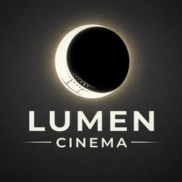

<p align="center">
  
</p>

<h1 align="center">🎬 Lumen Cinema</h1>

<p align="center">
  <strong>Backoffice Intranet para la gestión integral de un cine moderno</strong>
</p>

<p align="center">
  Sistema completo de operación cinematográfica desarrollado con React + Vite.<br/>
  Incluye POS, reservas, analytics, inventario, RRHH, accesibilidad e internacionalización.
</p>

---

<p align="center">
  
  
  
  
  
  
  
</p>

---

# 📚 Tabla de contenidos

- [✨ Características principales](#-características-principales)
- [🧱 Stack tecnológico](#-stack-tecnológico)
- [🏗️ Arquitectura](#️-arquitectura)
- [📁 Estructura del proyecto](#-estructura-del-proyecto)
- [🚀 Instalación](#-instalación)
- [⚙️ Variables de entorno](#️-variables-de-entorno)
- [🔐 Autenticación y roles](#-autenticación-y-roles)
- [🧭 Rutas del sistema](#-rutas-del-sistema)
- [🌍 Internacionalización](#-internacionalización)
- [♿ Accesibilidad](#-accesibilidad)
- [🧪 Modo demo](#-modo-demo)
- [🔌 Integración backend](#-integración-backend)
- [📦 Scripts disponibles](#-scripts-disponibles)

---

# ✨ Características principales

## 🏪 Punto de Venta (POS)

### 🎟️ Taquilla
- Selección de sesiones
- Mapa interactivo de butacas
- Gestión de tipos de entrada
- Búsqueda de clientes
- Pago con tarjeta, efectivo y QR
- Generación de tickets con QR

### 🍿 Concesiones
- Grid de productos por categorías
- Carrito dinámico
- Gestión de cantidades
- Cálculo automático de cambio
- CRUD completo de productos

---

## 📊 Dashboard & Analytics

- KPIs en tiempo real
- Tendencias de ingresos
- Ocupación por salas
- Top películas
- Productos más vendidos
- Alertas operativas
- Reportes exportables CSV

---

## 🎞️ Gestión de contenido

| Módulo | Funcionalidades |
|---|---|
| 🎬 Películas | CRUD, posters Cloudinary, filtros |
| 🏛️ Salas | Gestión de capacidad y estados |
| 🕒 Horarios | Programación de sesiones |
| 🎫 Reservas | Estados, pagos, cancelaciones, QR |

---

## 🛠️ Gestión operativa

| Módulo | Funcionalidades |
|---|---|
| 🚨 Incidencias | Prioridades, asignación, estados |
| 📦 Inventario | Stock mínimo, categorías |
| 📈 Reportes | Analytics avanzados |

---

## 👥 Recursos Humanos

| Módulo | Funcionalidades |
|---|---|
| 👨‍💼 Empleados | Roles y estados |
| 📅 Turnos | Calendario inteligente |
| 👤 Clientes | Fidelización y descuentos |

---

## 🌍 Internacionalización

- Español 🇪🇸 / Inglés 🇬🇧
- Detección automática del idioma
- Formateo Intl
- Traducciones dinámicas
- Persistencia en localStorage

---

## ♿ Accesibilidad

- Navegación completa por teclado
- Focus trap en modales
- ARIA labels
- Alto contraste
- Escalado tipográfico
- Screen Reader API
- Skip to content

---

# 🧱 Stack tecnológico

| Categoría | Tecnología |
|---|---|
| Frontend | React 19 |
| Bundler | Vite 8 |
| Routing | React Router 7 |
| Charts | Recharts |
| Pagos | Stripe |
| Iconos | Lucide React |
| QR | qrcode.react |
| Estilos | CSS Modules |
| Uploads | Cloudinary |
| Estado global | Context API |
| Linter | ESLint |

---

# 🏗️ Arquitectura

## Flujo principal

```txt
BrowserRouter
 └── AuthProvider
      └── LanguageProvider
           └── AppProvider
                └── Routes

```
## Arquitectura frontend
 ```
pages/
 ├── Dashboard
 ├── POS
 ├── Movies
 ├── Reports
 └── ...

components/
 ├── shared/
 ├── ui/
 └── accessibility/

contexts/
 ├── AuthContext
 ├── AppContext
 └── LanguageContext

services/
 ├── api.js
 ├── moviesService.js
 ├── reportsService.js
 └── ...

```
## 📁 Estructura del proyecto

```

FrontCine/
│
├── public/
├── src/
│   ├── assets/
│   ├── components/
│   ├── contexts/
│   ├── data/
│   ├── hooks/
│   ├── i18n/
│   ├── layouts/
│   ├── pages/
│   ├── services/
│   ├── App.jsx
│   └── main.jsx
│
├── .env
├── package.json
├── vite.config.js
└── README.md

```
---

# 🚀 Instalación

Requisitos

Node.js >= 18

npm >= 9

 ---
 
## Clonar proyecto

```
git clone <repo-url>
cd FrontCine

```
## Instalar dependencias

```
npm install

```

## Ejecutar entorno desarrollo

```
npm run dev

```
## Abrir:

```
http://localhost:5173

```
## Build producción

```
npm run build

```
## Preview producción

```
npm run preview

```
# ⚙️ Variables de entorno

## Crear .env:

```
VITE_API_URL=http://localhost:8080/api
VITE_API_TIMEOUT=10000

```

# 🔐 Autenticación y roles

---

## Sistema de autenticación

- JWT Authentication

- Persistencia en localStorage

- Restauración automática de sesión

- Logout automático por expiración

---

## Roles disponibles

| Rol         | Acceso            |
| ----------- | ----------------- |
| admin       | Acceso completo   |
| supervisor  | Gestión avanzada  |
| operator    | Operativa general |
| ticket      | Taquilla          |
| maintenance | Incidencias       |
| readonly    | Solo lectura      |

---

## Usuarios demo

| Usuario     | Password  |
| ----------- | --------- |
| admin1      | lumen2024 |
| supervisor1 | lumen2024 |
| operador1   | lumen2024 |
| taquilla1   | lumen2024 |

---

# 🧭 Rutas del sistema

---

| Ruta            | Descripción     |
| --------------- | --------------- |
| `/`             | Dashboard       |
| `/box-office`   | POS Taquilla    |
| `/concession`   | POS Concesiones |
| `/movies`       | Películas       |
| `/rooms`        | Salas           |
| `/schedules`    | Horarios        |
| `/reservations` | Reservas        |
| `/reports`      | Reportes        |
| `/inventory`    | Inventario      |
| `/employees`    | Empleados       |

---

# 🌍 Internacionalización

---

```
const { t, fmt } = useLanguage();

t('common.save');

fmt.currency(18.5);

fmt.date(new Date());

```

---

## Características

- Traducción ES/EN

- Intl API
  
- Formateo regional

- Persistencia automática

---

# ♿ Accesibilidad

Lumen Cinema sigue buenas prácticas modernas de accesibilidad:

- ✅ Navegación por teclado
- ✅ Compatibilidad con screen readers
- ✅ Focus management
- ✅ Contraste accesible
- ✅ Preferencias persistentes
- ✅ ARIA labels
- ✅ Skip navigation

---

# 🧪 Modo demo

El sistema funciona sin backend gracias a:

```txt
src/data/mockData.js
src/services/mockStore.js
```

## Incluye

- 🎬 Películas
- 🎫 Reservas
- 👥 Usuarios
- 🍿 Productos
- 📦 Inventario
- 📊 Analytics
- 💰 Ventas

---

# 🔌 Integración backend

Preparado para backend Spring Boot:

```txt
/api/auth
/api/movies
/api/rooms
/api/schedules
/api/reservations
```

## Características

- Cliente HTTP centralizado
- Bearer Token
- Manejo global de errores
- Hooks reutilizables
- Servicios desacoplados

---

# 📦 Scripts disponibles

```bash
npm run dev
npm run build
npm run preview
npm run lint
```

---

# 🧠 Características destacadas

- ✅ Arquitectura escalable
- ✅ Responsive Design
- ✅ POS completo
- ✅ Dashboard analítico
- ✅ Accesibilidad avanzada
- ✅ Sistema modular
- ✅ Modo demo
- ✅ Integración Stripe
- ✅ i18n ES/EN
- ✅ Gestión integral de cine

---

# ❤️ Autor

<p align="center">
  Desarrollado con pasión para la gestión moderna de cines 🎬
